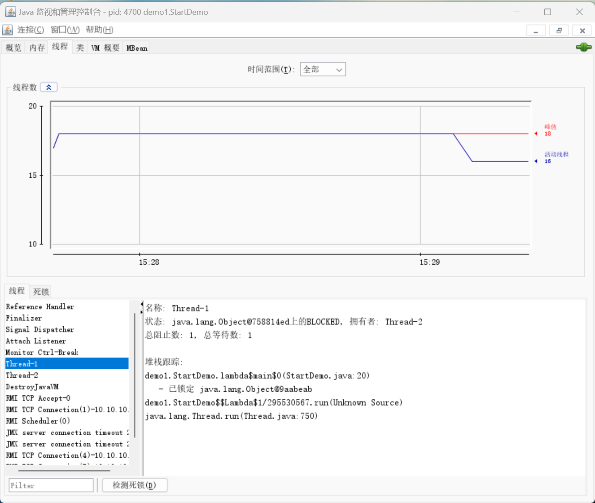
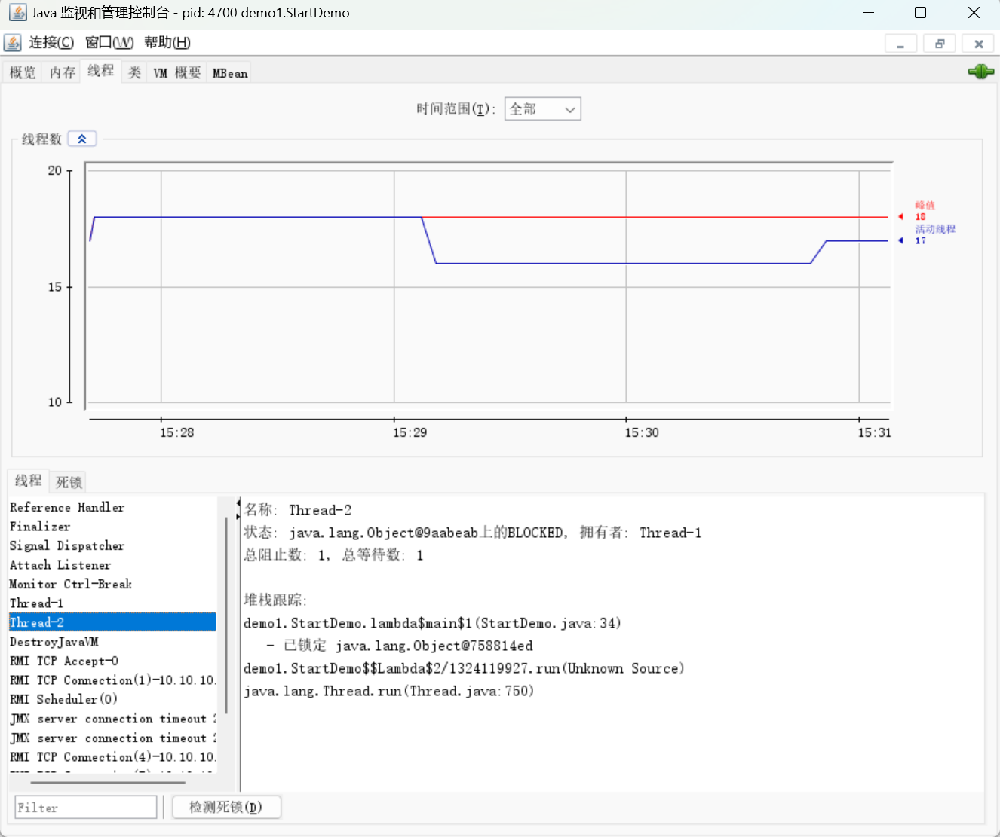
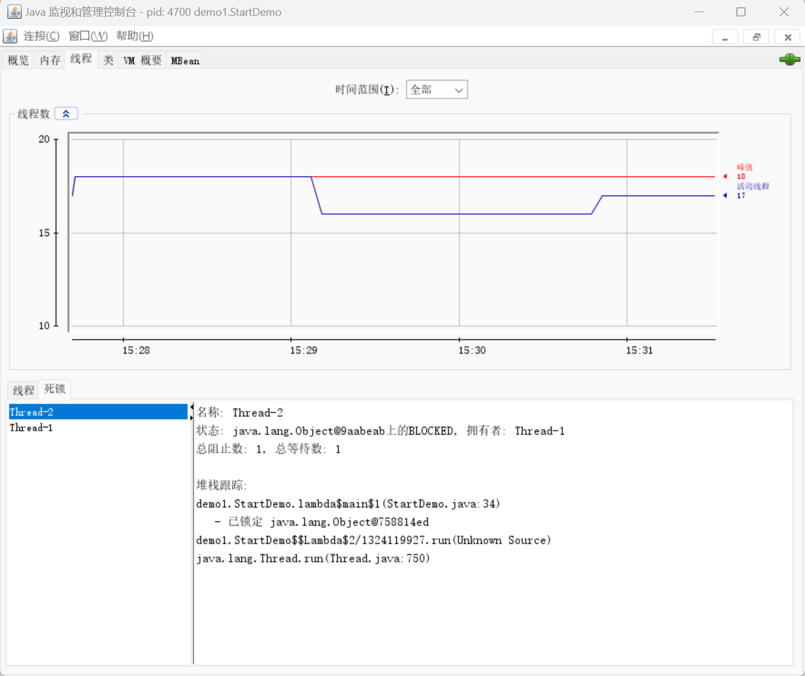
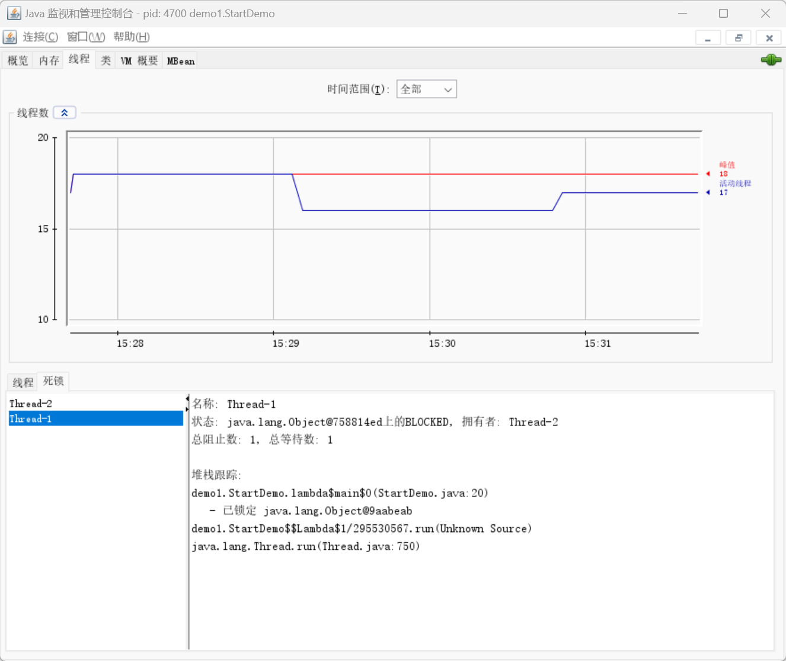

死锁是指两个或两个以上的线程在执行过程中, 因争夺资源而造成的一种互相等待的现象, 若无外力干涉, 那它们都将无法推进下去.  如果系统资源充足, 进程的资源请求都能都得到满足, 死锁出现的可能性就很低, 否则就会因争夺有限的资源而陷入死锁.

```java
public class StartDemo {  
  
    public static void main(String[] args) throws InterruptedException {  
  
  
        final Object objectA = new Object();  
        final Object objectB = new Object();  
  
        new Thread(() -> {  
            synchronized (objectA) {  
                System.out.println("线程A已获取A锁, 希望获得B锁");  
                try {  
                    Thread.sleep(500);  
                } catch (InterruptedException e) {  
                    throw new RuntimeException(e);  
                }  
                synchronized (objectB) {  
                    System.out.println("线程A已获得B锁");  
                }  
            }  
        }).start();  
  
        new Thread(() -> {  
            synchronized (objectB) {  
                System.out.println("线程B已获取B锁, 希望获得A锁");  
                try {  
                    Thread.sleep(500);  
                } catch (InterruptedException e) {  
                    throw new RuntimeException(e);  
                }  
                synchronized (objectA) {  
                    System.out.println("线程B已获得A锁");  
                }  
            }  
        }).start();  
    }  
  
}
```


### 死锁的排查

#### Java自带的工具
`JPS = java版的ps -ef`
`JPS -l`

```sh
PS D:\WorkSpace\IdeaProjects\juc-study> jps -l
13392 sun.tools.jps.Jps
18180 org.jetbrains.idea.maven.server.RemoteMavenServer36
20708 com.intellij.idea.Main
24852 org.jetbrains.jps.cmdline.Launcher
4700 demo1.StartDemo

PS D:\WorkSpace\IdeaProjects\juc-study> jstack 4700
2024-11-25 14:54:38
Full thread dump Java HotSpot(TM) 64-Bit Server VM (25.321-b07 mixed mode):

"JMX server connection timeout 27" #27 daemon prio=5 os_prio=0 tid=0x0000026c9755a000 nid=0x4500 in Object.wait() [0x0000007615dfe000]
   java.lang.Thread.State: TIMED_WAITING (on object monitor)
        at java.lang.Object.wait(Native Method)
        - waiting on <0x000000076d62f8c0> (a [I)
        at com.sun.jmx.remote.internal.ServerCommunicatorAdmin$Timeout.run(ServerCommunicatorAdmin.java:168)
        - locked <0x000000076d62f8c0> (a [I)
        at java.lang.Thread.run(Thread.java:750)

"RMI Scheduler(0)" #26 daemon prio=5 os_prio=0 tid=0x0000026c97555800 nid=0x6ccc waiting on condition [0x0000007615cfe000]
   java.lang.Thread.State: TIMED_WAITING (parking)
        at sun.misc.Unsafe.park(Native Method)
        - parking to wait for  <0x000000076d3a7de0> (a java.util.concurrent.locks.AbstractQueuedSynchronizer$ConditionObject)
        at java.util.concurrent.locks.LockSupport.parkNanos(LockSupport.java:215)
        at java.util.concurrent.locks.AbstractQueuedSynchronizer$ConditionObject.awaitNanos(AbstractQueuedSynchronizer.java:2078)
        at java.util.concurrent.ScheduledThreadPoolExecutor$DelayedWorkQueue.take(ScheduledThreadPoolExecutor.java:1093)
        at java.util.concurrent.ScheduledThreadPoolExecutor$DelayedWorkQueue.take(ScheduledThreadPoolExecutor.java:809)
        at java.util.concurrent.ThreadPoolExecutor.getTask(ThreadPoolExecutor.java:1074)
        at java.util.concurrent.ThreadPoolExecutor.runWorker(ThreadPoolExecutor.java:1134)
        at java.util.concurrent.ThreadPoolExecutor$Worker.run(ThreadPoolExecutor.java:624)
        at java.lang.Thread.run(Thread.java:750)

"RMI TCP Connection(1)-10.10.10.6" #25 daemon prio=5 os_prio=0 tid=0x0000026c9754b800 nid=0x68ec runnable [0x0000007615bfe000]
   java.lang.Thread.State: RUNNABLE
        at java.net.SocketInputStream.socketRead0(Native Method)
        at java.net.SocketInputStream.socketRead(SocketInputStream.java:116)
        at java.net.SocketInputStream.read(SocketInputStream.java:171)
        at java.net.SocketInputStream.read(SocketInputStream.java:141)
        at java.io.BufferedInputStream.fill(BufferedInputStream.java:246)
        at java.io.BufferedInputStream.read(BufferedInputStream.java:265)
        - locked <0x000000076d5b1d28> (a java.io.BufferedInputStream)
        at java.io.FilterInputStream.read(FilterInputStream.java:83)
        at sun.rmi.transport.tcp.TCPTransport.handleMessages(TCPTransport.java:555)
        at sun.rmi.transport.tcp.TCPTransport$ConnectionHandler.run0(TCPTransport.java:834)
        at sun.rmi.transport.tcp.TCPTransport$ConnectionHandler.lambda$run$0(TCPTransport.java:688)
        at sun.rmi.transport.tcp.TCPTransport$ConnectionHandler$$Lambda$5/2082450355.run(Unknown Source)
        at java.security.AccessController.doPrivileged(Native Method)
        at sun.rmi.transport.tcp.TCPTransport$ConnectionHandler.run(TCPTransport.java:687)
        at java.util.concurrent.ThreadPoolExecutor.runWorker(ThreadPoolExecutor.java:1149)
        at java.util.concurrent.ThreadPoolExecutor$Worker.run(ThreadPoolExecutor.java:624)
        at java.lang.Thread.run(Thread.java:750)

"RMI TCP Accept-0" #24 daemon prio=5 os_prio=0 tid=0x0000026c97563800 nid=0x71a0 runnable [0x0000007615aff000]
   java.lang.Thread.State: RUNNABLE
        at java.net.DualStackPlainSocketImpl.accept0(Native Method)
        at java.net.DualStackPlainSocketImpl.socketAccept(DualStackPlainSocketImpl.java:127)
        at java.net.AbstractPlainSocketImpl.accept(AbstractPlainSocketImpl.java:535)
        at java.net.PlainSocketImpl.accept(PlainSocketImpl.java:189)
        - locked <0x000000076d3be0f0> (a java.net.SocksSocketImpl)
        at java.net.ServerSocket.implAccept(ServerSocket.java:545)
        at java.net.ServerSocket.accept(ServerSocket.java:513)
        at sun.management.jmxremote.LocalRMIServerSocketFactory$1.accept(LocalRMIServerSocketFactory.java:52)
        at sun.rmi.transport.tcp.TCPTransport$AcceptLoop.executeAcceptLoop(TCPTransport.java:405)
        at sun.rmi.transport.tcp.TCPTransport$AcceptLoop.run(TCPTransport.java:377)
        at java.lang.Thread.run(Thread.java:750)

"DestroyJavaVM" #23 prio=5 os_prio=0 tid=0x0000026cf9551800 nid=0x556c waiting on condition [0x0000000000000000]
   java.lang.Thread.State: RUNNABLE

"Thread-2" #22 prio=5 os_prio=0 tid=0x0000026c974e5800 nid=0x5f04 waiting for monitor entry [0x00000076159fe000]
   java.lang.Thread.State: BLOCKED (on object monitor)
        at demo1.StartDemo.lambda$main$1(StartDemo.java:34)
        - waiting to lock <0x000000076c4152c8> (a java.lang.Object)
        - locked <0x000000076c4152d8> (a java.lang.Object)
        at demo1.StartDemo$$Lambda$2/1324119927.run(Unknown Source)
        at java.lang.Thread.run(Thread.java:750)

"Thread-1" #21 prio=5 os_prio=0 tid=0x0000026c974e2000 nid=0x6560 waiting for monitor entry [0x00000076158ff000]
   java.lang.Thread.State: BLOCKED (on object monitor)
        at demo1.StartDemo.lambda$main$0(StartDemo.java:20)
        - waiting to lock <0x000000076c4152d8> (a java.lang.Object)
        - locked <0x000000076c4152c8> (a java.lang.Object)
        at demo1.StartDemo$$Lambda$1/295530567.run(Unknown Source)
        at java.lang.Thread.run(Thread.java:750)

"Service Thread" #19 daemon prio=9 os_prio=0 tid=0x0000026c96fe1000 nid=0x2ab0 runnable [0x0000000000000000]
   java.lang.Thread.State: RUNNABLE

"C1 CompilerThread11" #18 daemon prio=9 os_prio=2 tid=0x0000026c96ee8800 nid=0x6e38 waiting on condition [0x0000000000000000]
   java.lang.Thread.State: RUNNABLE

"C1 CompilerThread10" #17 daemon prio=9 os_prio=2 tid=0x0000026c96eea000 nid=0x22cc waiting on condition [0x0000000000000000]
   java.lang.Thread.State: RUNNABLE

"C1 CompilerThread9" #16 daemon prio=9 os_prio=2 tid=0x0000026c96ee7800 nid=0x4450 waiting on condition [0x0000000000000000]
   java.lang.Thread.State: RUNNABLE

"C1 CompilerThread8" #15 daemon prio=9 os_prio=2 tid=0x0000026c96eeb800 nid=0x2910 waiting on condition [0x0000000000000000]
   java.lang.Thread.State: RUNNABLE

"C2 CompilerThread7" #14 daemon prio=9 os_prio=2 tid=0x0000026c96ee9000 nid=0x6fd8 waiting on condition [0x0000000000000000]
   java.lang.Thread.State: RUNNABLE

"C2 CompilerThread6" #13 daemon prio=9 os_prio=2 tid=0x0000026c96ed9800 nid=0x6058 waiting on condition [0x0000000000000000]
   java.lang.Thread.State: RUNNABLE

"C2 CompilerThread5" #12 daemon prio=9 os_prio=2 tid=0x0000026c96ed8800 nid=0x1f8c waiting on condition [0x0000000000000000]
   java.lang.Thread.State: RUNNABLE

"C2 CompilerThread4" #11 daemon prio=9 os_prio=2 tid=0x0000026c96ed3800 nid=0x6fb8 waiting on condition [0x0000000000000000]
   java.lang.Thread.State: RUNNABLE

"C2 CompilerThread3" #10 daemon prio=9 os_prio=2 tid=0x0000026c96ed3000 nid=0x3094 waiting on condition [0x0000000000000000]
   java.lang.Thread.State: RUNNABLE

"C2 CompilerThread2" #9 daemon prio=9 os_prio=2 tid=0x0000026c96ece000 nid=0x60b0 waiting on condition [0x0000000000000000]
   java.lang.Thread.State: RUNNABLE

"C2 CompilerThread1" #8 daemon prio=9 os_prio=2 tid=0x0000026c96ecb000 nid=0x1af0 waiting on condition [0x0000000000000000]
   java.lang.Thread.State: RUNNABLE

"C2 CompilerThread0" #7 daemon prio=9 os_prio=2 tid=0x0000026c96ebb000 nid=0x6418 waiting on condition [0x0000000000000000]
   java.lang.Thread.State: RUNNABLE

"Monitor Ctrl-Break" #6 daemon prio=5 os_prio=0 tid=0x0000026c96e9e800 nid=0x3480 runnable [0x00000076149fe000]
   java.lang.Thread.State: RUNNABLE
        at java.net.SocketInputStream.socketRead0(Native Method)
        at java.net.SocketInputStream.socketRead(SocketInputStream.java:116)
        at java.net.SocketInputStream.read(SocketInputStream.java:171)
        at java.net.SocketInputStream.read(SocketInputStream.java:141)
        at sun.nio.cs.StreamDecoder.readBytes(StreamDecoder.java:284)
        at sun.nio.cs.StreamDecoder.implRead(StreamDecoder.java:326)
        at sun.nio.cs.StreamDecoder.read(StreamDecoder.java:178)
        - locked <0x000000076c30ce10> (a java.io.InputStreamReader)
        at java.io.InputStreamReader.read(InputStreamReader.java:184)
        at java.io.BufferedReader.fill(BufferedReader.java:161)
        at java.io.BufferedReader.readLine(BufferedReader.java:324)
        - locked <0x000000076c30ce10> (a java.io.InputStreamReader)
        at java.io.BufferedReader.readLine(BufferedReader.java:389)
        at com.intellij.rt.execution.application.AppMainV2$1.run(AppMainV2.java:55)

"Attach Listener" #5 daemon prio=5 os_prio=2 tid=0x0000026c96e78800 nid=0x1cf4 waiting on condition [0x0000000000000000]
   java.lang.Thread.State: RUNNABLE

"Signal Dispatcher" #4 daemon prio=9 os_prio=2 tid=0x0000026c96e62800 nid=0x6280 runnable [0x0000000000000000]
   java.lang.Thread.State: RUNNABLE

"Finalizer" #3 daemon prio=8 os_prio=1 tid=0x0000026cfd2d8000 nid=0x68c8 in Object.wait() [0x00000076146ff000]
   java.lang.Thread.State: WAITING (on object monitor)
        at java.lang.Object.wait(Native Method)
        - waiting on <0x000000076c188ee8> (a java.lang.ref.ReferenceQueue$Lock)
        at java.lang.ref.ReferenceQueue.remove(ReferenceQueue.java:144)
        - locked <0x000000076c188ee8> (a java.lang.ref.ReferenceQueue$Lock)
        at java.lang.ref.ReferenceQueue.remove(ReferenceQueue.java:165)
        at java.lang.ref.Finalizer$FinalizerThread.run(Finalizer.java:216)

"Reference Handler" #2 daemon prio=10 os_prio=2 tid=0x0000026c96e01000 nid=0x6d08 in Object.wait() [0x00000076145ff000]
   java.lang.Thread.State: WAITING (on object monitor)
        at java.lang.Object.wait(Native Method)
        - waiting on <0x000000076c186c00> (a java.lang.ref.Reference$Lock)
        at java.lang.Object.wait(Object.java:502)
        at java.lang.ref.Reference.tryHandlePending(Reference.java:191)
        - locked <0x000000076c186c00> (a java.lang.ref.Reference$Lock)
        at java.lang.ref.Reference$ReferenceHandler.run(Reference.java:153)

"VM Thread" os_prio=2 tid=0x0000026cfd2c6000 nid=0x6f5c runnable

"GC task thread#0 (ParallelGC)" os_prio=0 tid=0x0000026cf9566800 nid=0x66dc runnable

"GC task thread#1 (ParallelGC)" os_prio=0 tid=0x0000026cf9567800 nid=0x7458 runnable

"GC task thread#2 (ParallelGC)" os_prio=0 tid=0x0000026cf9569000 nid=0x7398 runnable

"GC task thread#3 (ParallelGC)" os_prio=0 tid=0x0000026cf956a800 nid=0x6e30 runnable

"GC task thread#4 (ParallelGC)" os_prio=0 tid=0x0000026cf956d000 nid=0x3db8 runnable

"GC task thread#5 (ParallelGC)" os_prio=0 tid=0x0000026cf956e000 nid=0x6c10 runnable

"GC task thread#6 (ParallelGC)" os_prio=0 tid=0x0000026cf9571000 nid=0x4e3c runnable

"GC task thread#7 (ParallelGC)" os_prio=0 tid=0x0000026cf9573000 nid=0x5544 runnable

"GC task thread#8 (ParallelGC)" os_prio=0 tid=0x0000026cf9574000 nid=0x3988 runnable

"GC task thread#9 (ParallelGC)" os_prio=0 tid=0x0000026cf9575000 nid=0x7530 runnable

"GC task thread#10 (ParallelGC)" os_prio=0 tid=0x0000026cf9576000 nid=0x1118 runnable

"GC task thread#11 (ParallelGC)" os_prio=0 tid=0x0000026cf9579000 nid=0x6d38 runnable

"GC task thread#12 (ParallelGC)" os_prio=0 tid=0x0000026cf957a000 nid=0x64c0 runnable

"VM Periodic Task Thread" os_prio=2 tid=0x0000026c96fea000 nid=0x71c waiting on condition

JNI global references: 341


Found one Java-level deadlock:
=============================
"Thread-2":
  waiting to lock monitor 0x0000026cfd2d50e8 (object 0x000000076c4152c8, a java.lang.Object),
  which is held by "Thread-1"
"Thread-1":
  waiting to lock monitor 0x0000026cfd2d7978 (object 0x000000076c4152d8, a java.lang.Object),
  which is held by "Thread-2"

Java stack information for the threads listed above:
===================================================
"Thread-2":
        at demo1.StartDemo.lambda$main$1(StartDemo.java:34)
        - waiting to lock <0x000000076c4152c8> (a java.lang.Object)
        - locked <0x000000076c4152d8> (a java.lang.Object)
        at demo1.StartDemo$$Lambda$2/1324119927.run(Unknown Source)
        at java.lang.Thread.run(Thread.java:750)
"Thread-1":
        at demo1.StartDemo.lambda$main$0(StartDemo.java:20)
        - waiting to lock <0x000000076c4152d8> (a java.lang.Object)
        - locked <0x000000076c4152c8> (a java.lang.Object)
        at demo1.StartDemo$$Lambda$1/295530567.run(Unknown Source)
        at java.lang.Thread.run(Thread.java:750)

Found 1 deadlock.


```


#### JConsole






检测死锁






