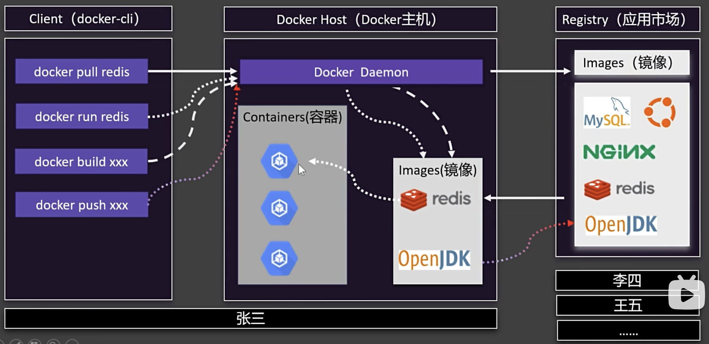
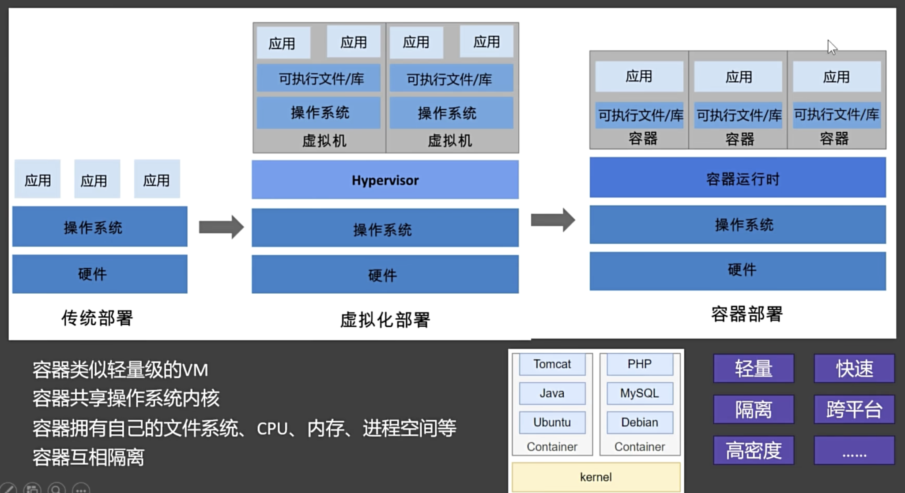
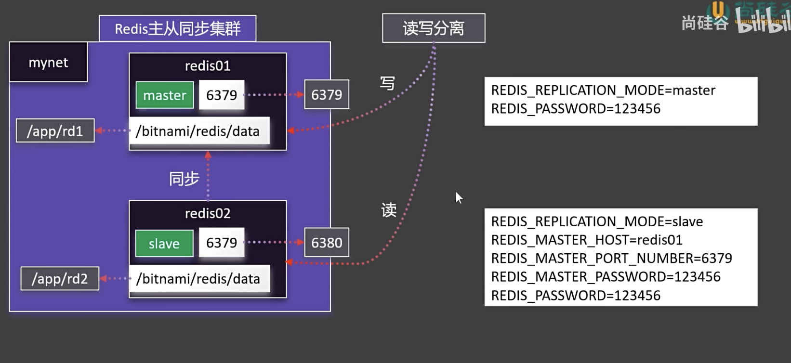

##### 1.为什么要有docker

​	跨平台

1. 快速构建应用
2. 快速分享应用
3. 快速运行应用

##### 2.docker如何工作






##### 3.镜像命令

检索: docker search

下载: docker pull

列表: docker images

删除: docker rmi


##### 4.容器命令

运行: docker run  *

```sh
docker run 
				   -d 
					 --name mynginx 
					 -p 80:80
					 nginx
```

查看: docker ps

停止: docker stop

启动: docker start

重启: docker restart

状态: docker stats

日志: docker logs

进入: docker exec  *

```sh
docker exec
						-it
						mynginx /bin/bash
```

删除: docker rm


##### 5.分享命令

提交: docker commit

保存: docker save

加载: docker load

登录: docker login

命名: docker tag

推送: docker push


##### 6.命令的丰富使用

强制删除所有容器: docker rm -f $(docker ps -aq)

目录挂载: docker run -d -p 80:80 -v /app/nghtml:/usr/share/nginx/html --name app03 nginx

卷映射: docker run -d -p 80:80 -v ngconf:/etc/nginx --name app03 nginx

​					映射的位置统一放在了: /var/lib/docker/volumes/\<volume-name\>

查看所有卷的命令: docker volume ls

查看卷的详情: docker volume inspect ngconf


##### 7.docker网络

docker0网络

查看容器详情: docker container inspect app1

docker0作为默认网络, 不支持主机域名, 而且, 每个容器的ip地址不固定 , 导致难以便捷地访问.

解决办法是: 创建自定义网络, 容器名就是稳定域名.


创建自定义网络: docker network create mynet

列出所有网络: docker network ls


容器启动时加入自定义网络: docker run -d -p 88:80 --name app1 --network mynet nginx


8.搭建redis主从集群



```sh
docker run -d -p 6379:6379 \
	-v /app/rd1:/bitnami/redis/data \
	-e REDIS_REPLICATION_MODE=master \
	-e REDIS_PASSWORD=123456 \
	--network mynet --name reids01 \
	bitnami/redis
```

```sh
docker run -d -p 6380:6379 \
	-v /app/rd2:/bitnami/redis/data \
	-e REDIS_REPLICATION_MODE=slave \
	-e REDIS_MASTER_HOST=redis01
	-e REDIS_MASTER_PORT_NUMBER=6379
	-e REDIS_MASTER_PASSWORD=123456
	-e REDIS_PASSWORD=123456 \
	--network mynet --name reids02 \
	bitnami/redis
```


##### 8.docker compose命令

上线: docker compose -f compose.yaml up -d   (-d 以后台方式)

下线: docker compose -f compose.yaml down

启动: docker compose -f compose.yaml start x1 x2 x3

上线是第一次创建应用并启动, 启动是之前已经上线过了, 停掉了, 再重新启动. 

停止: docker compose -f compose.yaml stop x1 x3

扩容: docker compose -f compose.yaml scale x2=3


##### 9.compose语法

顶级元素:

- name		名字
- services         服务
- networks       网络
- volumes        卷
- configs          配置
- secrets          密钥


##### 10.Dockerfile

FROM		 指定镜像基础环境

RUN		   运行自定义命令

CMD		   容器启动命令或参数

LABEL	      自定义标签

EXPOSE	   指定暴露端口

ENV		   环境变量

ADD		   添加文件到镜像

COPY		 复制文件到镜像

ENTRYPOINT  容器固定启动命令

VOLUME	   数据卷

USER		指定用户和用户组

WORKDIR	指定默认工作目录

ARG		  指定构建参数


构建命令: docker build -f Dockerfile -t -t myjavaapp:v1.0 .


