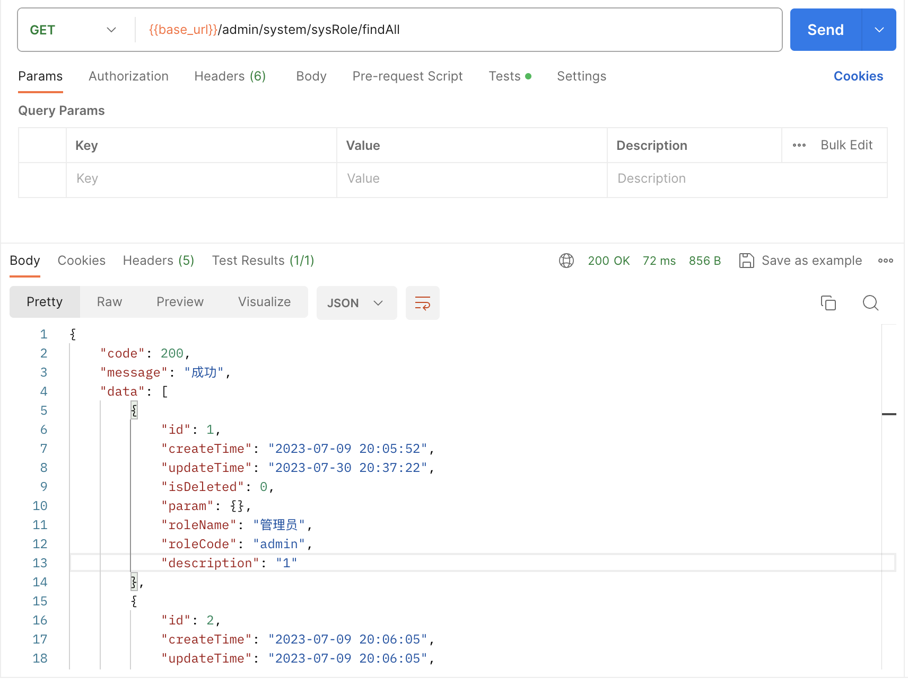
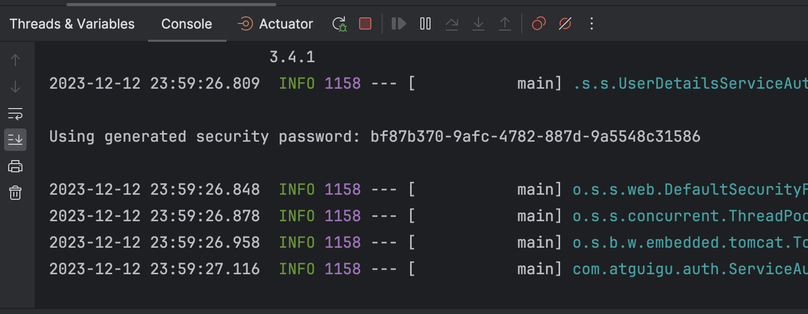
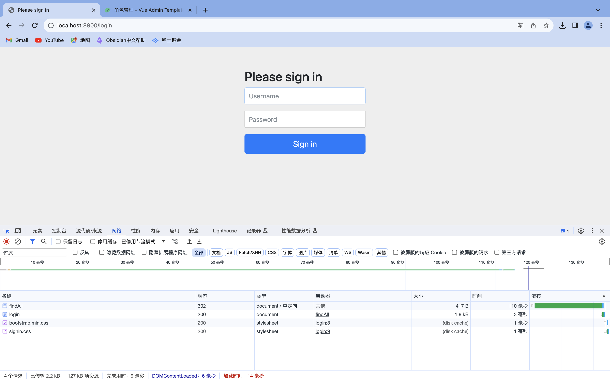
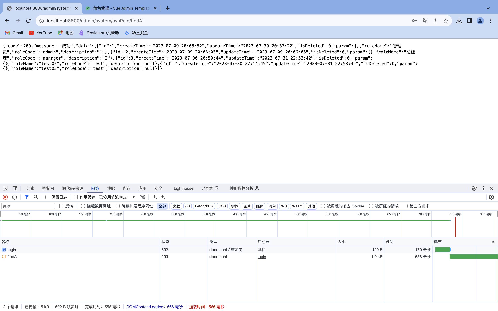
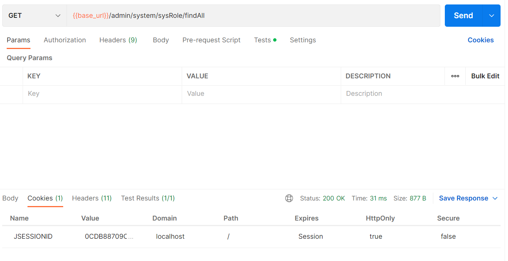
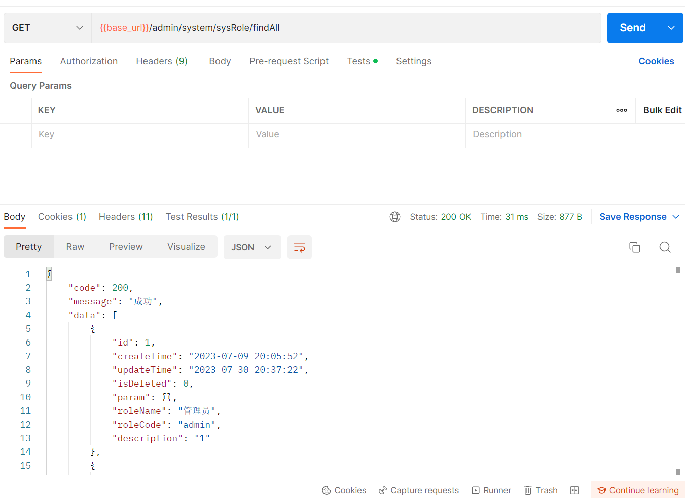

> 这是记录spring security的第一篇笔记, 未必很快得到甚解, 但求记录一些使用中的心得体会, 一步步深入.

### 一. 使用背景

​	 在练习尚硅谷在B站发布的办公系统时, 用到spring security. 这并不是我第一次使用这个安全框架, 虽未在工作中使用这个框架, 但在之前的学习中也有过一次简单的接触. 这一次再碰到它时, 依然感觉很陌生, 再加上我又立志于开始用一些有痕迹的方式记录我的学习过程, 所以便觉得有记录下来的必要了.


### 二. 使用之前

​	 在使用spring security这个框架之前, 已经利用vue + spring security做了用户的权限设置. 利用该种方式, 可以做到根据登陆的用户不同, 对用户展示的页面不同, 使用户具有不同的操作权限. 

​	 然而, 所谓“防君子, 不防小人”. 如果, 用户只是登陆后在页面进行操作, 自然可以受到权限约束. 如果用户直接模拟浏览器对后台发起接口调用, 后台却无法进行有效的权限控制, 而是把请求结果直接响应给请求者. 



### 三. 引入spring security

​	 引入spring security依赖, 并添加如下配置类后, 重新启动项目. 可以看到控制台打印了一段自动生成的密码.

```java
@Configuration
@EnableWebSecurity
public class WebSecurityConfig extends WebSecurityConfigurerAdapter {
  
}
```



​	 此时, 如果再次使用postman调用之前调用的接口, 因为spring security会判断出不是浏览器发出的请求, 所以不会进行重定向, 而是会报如下错误:


​	 如果用浏览器访问刚刚的接口, 则会由于配置了spring security的原因, 进行重定向到如下页面:



​	 默认用户名为user, 密码就是控制台刚刚打印的字符串(此时的密码是随机生成的, 每次启动项目都会随机生成一个新的密码). 输入用户名密码之后, 则可以看到, 登录后成功重定向到刚刚访问的接口, 并响应.




### 四. spring security的基本使用

​	 从上面可以看到, 只要引入依赖并开启了spring security的配置, spring security就开始生效了. 不过现在, 用的还是spring security默认的认证方式, 即

- 如果是第一次访问(未登录状态): 跳转到登录页面, 此时user为用户名, 自动生成的字符串为密码. 输入即可重定向到刚刚请求的地址看到请求的响应.
- 如果已经输入过一次账号密码, 则浏览器会保存一个JSESSIONID, 再次请求时会通过认证,  直接响应请求结果. 利用这一点, 也可以使用postman请求接口, 并得到响应.





​	 显然这种方式十分不便, 每次启动项目都会产生一个随机的密码, 登录页面也是spring security提供的页面. 更多情况下, 需要我们自定义登录的账号和密码. 因此, 我们需要自定义spring security进行用户认证的相关组件.